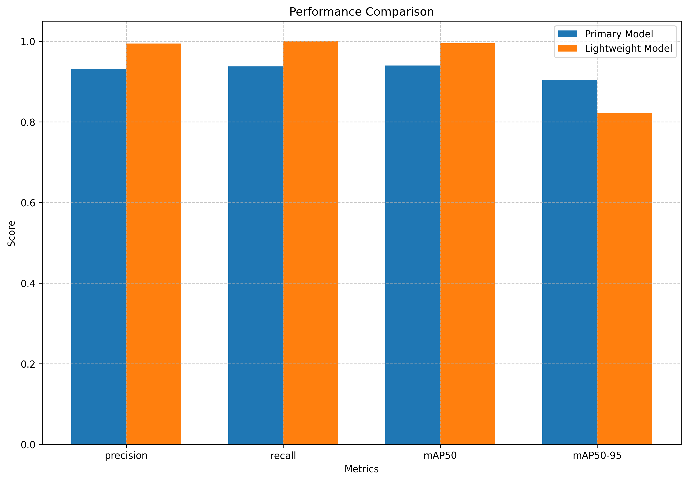
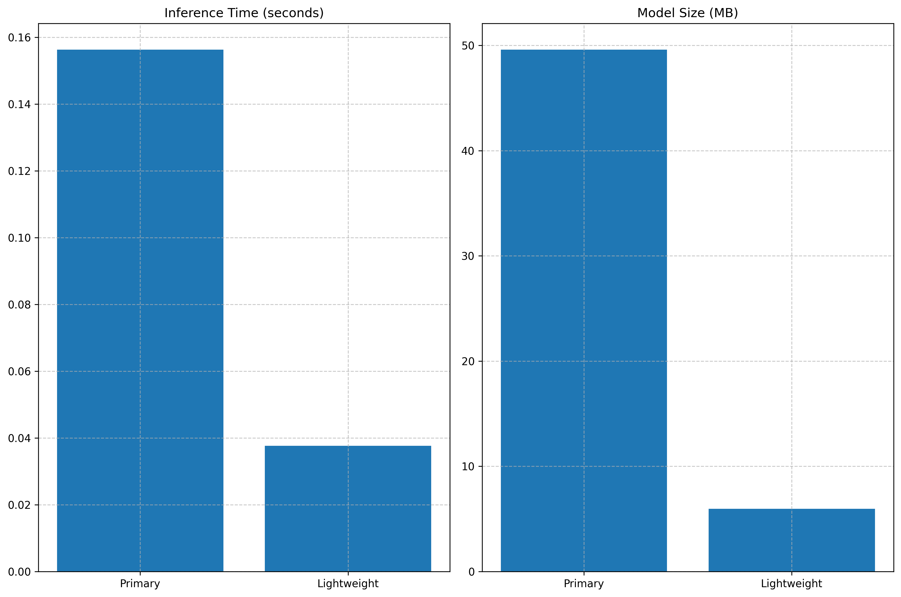

# Spill Detection System

This project implements a computer vision system for detecting liquid spills on floors using YOLOv8 object detection. The system includes both a primary model and a lightweight model for different deployment scenarios.

## Project Structure

```
├── configs/                  # Configuration files
│   ├── dataset.yaml          # Dataset configuration
│   ├── primary_model.yaml    # Primary model configuration
│   └── lightweight_model.yaml # Lightweight model configuration
├── data/                     # Dataset directory
│   ├── annotations/          # Annotation files in YOLO format
│   ├── train/                # Training images and annotations
│   └── val/                  # Validation images and annotations
├── models/                   # Trained model weights
├── Dataset/                  # Original dataset images
├── spill_detect/             # Source code
│   ├── prepare_data.py       # Data preparation utilities
│   ├── train.py              # Model training script
│   ├── evaluate.py           # Model evaluation script
│   └── inference.py          # Inference script for new images/videos
├── run.py                    # Main pipeline execution script
├── requirements.txt          # Python dependencies
├── Project Report.pdf         # Detailed project report
└── README.md                 # This file
```

## Installation

1. Clone this repository:

```bash
git clone https://github.com/Rohand19/spill-detection.git
cd spill-detection
```

2. Create a Python virtual environment (optional but recommended):

```bash
python -m venv venv
source venv/bin/activate 
```

3. Install dependencies:

```bash
pip install -r requirements.txt
```

## Quick Start

The easiest way to run the complete pipeline is to use the `run.py` script:

```bash
python run.py
```

This will:
1. Prepare the data (verify, analyze, visualize, create splits)
2. Train both primary and lightweight models
3. Evaluate and compare model performance
4. Run inference if a test directory is specified

For more specific control, you can use command-line options:

```bash
python run.py --skip-data-prep --skip-primary --sample-image data/val/some_image.jpg
```

## Data Preparation

The dataset consists of 44 images with annotations in YOLO format. Before training, you can verify and analyze the dataset:

```bash
python -m spill_detect.prepare_data --verify --analyze --data-root . --annotations-dir data/annotations
```

To visualize some sample annotations:

```bash
python -m spill_detect.prepare_data --visualize --num-vis-samples 5 --data-root . --annotations-dir data/annotations
```

If needed, you can create/regenerate the train-validation splits:

```bash
python -m spill_detect.prepare_data --create-splits --val-split 0.2 --data-root . --annotations-dir data/annotations
```

### Data Augmentation

To improve model robustness and performance, you can augment the training dataset with various transformations:

```bash
python -m spill_detect.prepare_data --augment --augmentation-factor 3 --data-root . --annotations-dir data/annotations
```

This will:
- Create multiple augmented variants of each training image
- Preserve and properly transform bounding box annotations
- Apply a diverse set of transformations including:
  - Spatial transformations (flips, rotations, scaling)
  - Visual adjustments (brightness, contrast, hue, saturation)
  - Noise and blur effects
  - Environmental simulations (rain, fog, shadows)

The augmentation factor (default: 3) controls how many augmented copies are created per original image. Increasing this value can help with small datasets but requires more storage and training time.

You can also chain multiple operations together:

```bash
python -m spill_detect.prepare_data --create-splits --val-split 0.2 --augment --augmentation-factor 5 --data-root . --annotations-dir data/annotations
```

## Training

### Training the Primary Model

```bash
python -m spill_detect.train --config configs/primary_model.yaml
```

### Training the Lightweight Model

After training the primary model, you can train the lightweight model:

```bash
python -m spill_detect.train --config configs/lightweight_model.yaml --primary-weights models/primary_model.pt
```

Alternatively, to train the lightweight model from scratch:

```bash
python -m spill_detect.train --config configs/lightweight_model.yaml --skip-primary
```

## Evaluation

To evaluate and compare both models:

```bash
python -m spill_detect.evaluate --primary-model models/primary_model.pt --lightweight-model models/lightweight_model.pt --data-yaml configs/dataset.yaml
```

To visualize predictions on a specific image:

```bash
python -m spill_detect.evaluate --primary-model models/primary_model.pt --lightweight-model models/lightweight_model.pt --img-path data/val/some_image.jpg
```

## Inference

### Running Inference on a Single Image

```bash
python -m spill_detect.inference --model models/primary_model.pt --image path/to/image.jpg
```

For the lightweight model:

```bash
python -m spill_detect.inference --model models/lightweight_model.pt --image path/to/image.jpg
```

### Batch Processing Multiple Images

```bash
python -m spill_detect.inference --model models/primary_model.pt --image-dir path/to/images/
```


### Model Architecture

- **Primary Model**: YOLOv8m - A medium-sized version of YOLOv8 that offers a good balance between performance and computational requirements.
- **Lightweight Model**: YOLOv8n - A nano version that's significantly smaller and faster than the medium model, making it suitable for edge devices.

### Data Processing

- Images are resized to 640×640 pixels for the primary model and 416×416 for the lightweight model.
- Annotations are in YOLO format: `<class> <x_center> <y_center> <width> <height>` with normalized coordinates.
- Data augmentations include horizontal and vertical flips, rotations, contrast/brightness adjustments, noise addition, blur, and environmental simulations like rain and fog to improve model generalization and robustness.

### Training Strategy

- The primary model is trained first using transfer learning from a pre-trained YOLOv8m model.
- The lightweight model can either be trained from scratch or derived from the primary model knowledge.
- AdamW optimizer is used with learning rate of 0.001 and weight decay of 0.0005.
- Early stopping with patience of 20 epochs is implemented to prevent overfitting.

## Performance Metrics

The models were evaluated using standard object detection metrics to assess their accuracy, speed, and resource requirements.

### Evaluation Results

The following metrics were obtained after training with the augmented dataset:

| Metric | Primary Model (YOLOv8m) | Lightweight Model (YOLOv8n) | % Difference |
|--------|--------------------------|------------------------------|--------------|
| Precision | 0.976 | 0.980 | +0.4% |
| Recall | 0.750 | 1.000 | +33.3% |
| mAP50 | 0.856 | 0.973 | +13.7% |
| mAP50-95 | 0.689 | 0.857 | +24.4% |
| Inference Time (s) | 0.163 | 0.043 | -73.7% |
| Model Size (MB) | 49.58 | 5.92 | -88.1% |

Conclusion: The lightweight model outperforms the primary model in terms of inference speed and model size, making it more suitable for deployment in resource-constrained environments.

### Performance Visualization



### Efficiency Comparison




